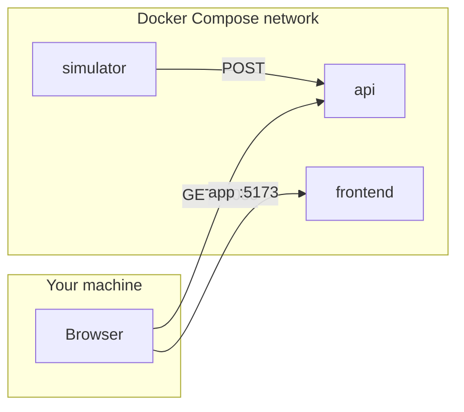

# Demo toolkit

This repo is a **one-command local demo**: a Python **producer** ([`simulator/`](simulator/)), a Spring Boot **API** ([`api/`](api/)), and a React + Vite **UI** ([`frontend/`](frontend/)). Data flows **simulator → API → browser** (see [Architecture](#architecture-at-a-glance) below).

**Limitation:** tracks are stored **in memory** only ([`Application.java`](api/src/main/java/com/demo/Application.java)). Restarting the `api` container clears them. **Planned upgrade:** replace the list with **H2** (embedded DB) for persistence suitable for demos—see [CONCEPTS_AND_TOOLS.md](docs/CONCEPTS_AND_TOOLS.md#in-memory-storage).

### Docs

- **[`docs/CONCEPTS_AND_TOOLS.md`](docs/CONCEPTS_AND_TOOLS.md)** — full breakdown of Docker, networking, HTTP/REST, CORS, Spring Boot, React/Vite, and glossary (start here for depth).
- [`docs/TRAINING_RAMP.md`](docs/TRAINING_RAMP.md) — week-by-week ramp with checkboxes.
- [`docs/KNOWLEDGE_CHECKS.md`](docs/KNOWLEDGE_CHECKS.md) — written self-tests + answer key.

---

## Architecture at a glance



Details: service names as DNS (`api` vs `localhost`), port publishing, `depends_on`, and end-to-end data flow are explained in [`docs/CONCEPTS_AND_TOOLS.md`](docs/CONCEPTS_AND_TOOLS.md).

---

## Run and verify

```bash
docker compose up --build
```

- **Frontend:** [http://localhost:5173](http://localhost:5173)
- **API (JSON):** [http://localhost:8080/tracks](http://localhost:8080/tracks)

**Sanity check:** simulator logs show `sent {...}`; `/tracks` in the browser shows a growing array; the UI lists coordinates and speeds updating.

---

## Work demos (short)

**Pitch:** three containers—fake telemetry, ingest API, dashboard polling over HTTP—wired by Compose, one command to run.

**Avoid implying** persistent storage, auth, or production scale unless you add them. Roadmap ideas (WebSockets/SSE, maps, alerts, Kafka, charts) and vocabulary: [CONCEPTS_AND_TOOLS.md](docs/CONCEPTS_AND_TOOLS.md).

---

## Repository layout

| Path | Stack |
|------|--------|
| [`api/`](api/) | Spring Boot 3.2, Java 17, Gradle |
| [`simulator/`](simulator/) | Python 3.10, `requests` |
| [`frontend/`](frontend/) | React 18, Vite 5 |
