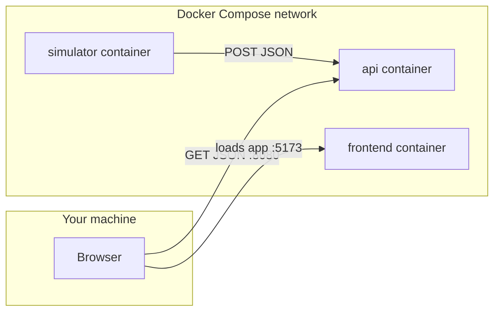

# Concepts and tools (deep dive)

This document explains the **technologies, patterns, and vocabulary** used in this repository. It expands on what used to live in the root [README.md](../README.md). For how to run the stack, use the README; for a structured learning path, see [TRAINING_RAMP.md](TRAINING_RAMP.md).

---

## Table of contents

1. [What this stack is](#what-this-stack-is)
2. [Architecture and data flow](#architecture-and-data-flow)
3. [Docker and Docker Compose](#docker-and-docker-compose)
4. [Networking: hosts, ports, and DNS](#networking-hosts-ports-and-dns)
5. [HTTP, REST, and JSON](#http-rest-and-json)
6. [Browsers: origins and CORS](#browsers-origins-and-cors)
7. [Spring Boot (Java API)](#spring-boot-java-api)
8. [Python simulator](#python-simulator)
9. [React and Vite (frontend)](#react-and-vite-frontend)
10. [Glossary](#glossary)
11. [Work demos: narrative and boundaries](#work-demos-narrative-and-boundaries)

---

## What this stack is

You have three cooperating processes:

| Piece | Technology | Role |
|-------|------------|------|
| Producer | Python | Generates fake “tracks” and sends them to the API over HTTP. |
| Backend | Spring Boot (Java) | Accepts JSON, stores it in memory, serves it back as JSON. |
| UI | React + Vite | Runs in the browser; repeatedly asks the API for the latest list and renders it. |
| Packaging | Docker + Compose | Builds images and runs all three on a shared virtual network with predictable ports. |

**Limitation (demo realism):** Tracks live in an in-memory [`ArrayList`](../api/src/main/java/com/demo/Application.java). No database. Restarting the `api` container wipes data. That keeps the demo small; it is not a production persistence model.

---

## Architecture and data flow

### Diagram



### Narrative

[`docker-compose.yml`](../docker-compose.yml) declares **services**. Each service is built from a **context** directory (`./api`, `./simulator`, `./frontend`) using that directory’s **Dockerfile**. Compose creates a **default network** and attaches every service to it. Containers on that network can resolve each other by **service name** as a hostname (Docker’s embedded DNS).

### End-to-end sequence

1. **Simulator → API:** [`simulator.py`](../simulator/simulator.py) builds a Python `dict`, serializes it to JSON, and `POST`s to `http://api:8080/tracks` on the Compose network.
2. **API:** Spring deserializes the body into a `Map`, adds `id` (UUID) and `timestamp`, appends to the in-memory list.
3. **Browser → API:** [`App.jsx`](../frontend/src/App.jsx) runs in the browser. It `fetch`es `http://localhost:8080/tracks` on an interval (**polling**), parses JSON, updates React state, and the list re-renders.

**Hostname rule:** From **inside** a container, use the **service name** (`api`). From your **laptop browser**, use **`localhost`** and the **published** host port (`8080`), because port mapping bridges host ↔ container.

---

## Docker and Docker Compose

### Core vocabulary

- **Image:** An immutable template: filesystem snapshot + default command. Built from a `Dockerfile` (recipe) or pulled from a registry (e.g. Docker Hub).
- **Container:** A running (or stopped) instance of an image—like a lightweight VM focused on one main process.
- **Registry / repository:** Where images are stored and shared (e.g. `python:3.10`, `eclipse-temurin:17-jdk`, `node:18` in this repo’s Dockerfiles).
- **Build context:** The directory sent to the Docker daemon when you `docker build` or Compose `build:`. Only files in that context are available to `COPY` (unless excluded).

### Dockerfile instructions (as used here)

| Instruction | Meaning |
|-------------|---------|
| `FROM` | Start from a parent image (OS + runtime preinstalled). |
| `WORKDIR` | Set the default directory for later commands. |
| `COPY` | Copy files from build context into the image. |
| `RUN` | Execute a command **while building** the image (e.g. `pip install`, `./gradlew bootJar`). |
| `CMD` | Default command when a **container starts** (can be overridden by `docker run`). |

**Layers:** Each instruction that changes the filesystem creates a **layer**. Reordered or cached layers speed rebuilds. Changing source code often invalidates later layers—expect API and frontend images to rebuild when you edit those folders.

**`.dockerignore`:** Optional file in the build context (like `.gitignore`) to exclude `node_modules`, `build/`, etc., from the context. This repo does not ship one yet; adding it reduces image size and build time as the project grows.

### Docker Compose

Compose is a **declarative** way to run multi-container apps.

- **`services`:** Named units (here: `api`, `simulator`, `frontend`). Names become **DNS names** on the project network.
- **`build: ./api`:** Build image from that directory’s Dockerfile (default filename `Dockerfile`).
- **`ports: "8080:8080"`:** **Port publish**: map **host** port 8080 to **container** port 8080. The API listens on 8080 inside the container; your Mac can reach it at `localhost:8080`.
- **`depends_on`:** Start order only. Compose starts `api` before `simulator` and `frontend`; it does **not** wait for the JVM to listen on 8080. Brief connection errors from the simulator on first boot are common until the API is ready.

### Useful commands (reference)

```bash
docker compose up --build    # build if needed, start all services, attach logs
docker compose up -d         # detached (background)
docker compose logs -f api    # follow logs for one service
docker compose ps             # container status
docker compose down           # stop and remove containers (default network removed)
```

`docker compose build --no-cache` forces a clean rebuild when you suspect stale layers.

### Why Docker for sales / demo engineering

- **Reproducibility:** Same stack on your laptop and a colleague’s.
- **Fewer “works on my machine” issues:** Dependencies live inside images.
- **One command story:** `docker compose up --build` is easy to narrate in a meeting.

---

## Networking: hosts, ports, and DNS

### Published ports vs internal ports

- **Inside the container**, Spring Boot listens on **8080** (default for `spring-boot-starter-web`).
- **Publishing** `8080:8080` makes that socket reachable from the **host** at `localhost:8080`.
- The **simulator** does not publish any port; it only **initiates** outbound TCP connections to `api:8080`. Nothing needs to connect *into* the simulator container.

### Docker’s internal DNS

On the Compose network, the name `api` resolves to the **current** IP of the `api` container. That is why [`simulator.py`](../simulator/simulator.py) uses `http://api:8080`.

### `localhost` is contextual

- **`localhost` inside the simulator container** = the simulator itself, not the API.
- **`localhost` on your Mac** = your machine, where published ports appear.

This distinction is one of the most common sources of confusion when mixing browser, host, and container networking.

---

## HTTP, REST, and JSON

### HTTP basics

- **Request:** method, URL, headers, optional body.
- **Response:** status code, headers, optional body.
- Common methods here: **GET** (read), **POST** (submit a new resource body).

### REST (Representational State Transfer)

REST is an **architectural style**, not a single standard. In practice people mean: resources identified by URLs, operations expressed with HTTP methods, often JSON bodies.

This API:

- **`GET /tracks`** — returns a JSON array of track objects (the whole collection as exposed by the demo).
- **`POST /tracks`** — accepts a JSON object; the server enriches it and appends to storage.

### JSON

**JavaScript Object Notation** — text encoding of objects and arrays. APIs use it because browsers and most languages parse it easily. Spring Boot uses Jackson (via starter-web) to convert JSON ↔ Java objects/`Map`. Python `requests` with `json=` sets `Content-Type: application/json` and encodes the dict.

### Status codes (minimal set for demos)

- **200 OK** — success for GET (and often POST in simple APIs).
- **4xx** — client error (bad request, not found).
- **5xx** — server error.

Your demo endpoints do not customize status codes heavily; knowing the categories helps when you extend the API.

---

## Browsers: origins and CORS

### Origin

An **origin** is scheme + host + port, e.g. `http://localhost:5173` vs `http://localhost:8080`. Different ports = **different origins**.

### Same-origin policy

Browsers restrict how a page from one origin can read responses from another origin. That protects users (e.g. random sites reading your bank API). Your UI is served from **5173** and the API from **8080**, so they are cross-origin.

### CORS (Cross-Origin Resource Sharing)

The **server** can include headers (e.g. `Access-Control-Allow-Origin`) telling the browser that cross-origin reads are allowed for specific callers. Spring’s `@CrossOrigin` on [`Application`](../api/src/main/java/com/demo/Application.java) enables that for browser `fetch` calls.

**Server-to-server** calls (Python → Java) are **not** subject to browser CORS; the Python process is not a browser enforcing same-origin policy.

### Simple vs preflight requests

`GET` and “simple” POSTs may go straight through. Some requests trigger an **OPTIONS preflight**; Spring can handle that when CORS is configured. For demos, knowing CORS exists is enough until you add unusual headers or methods.

---

## Spring Boot (Java API)

### What Spring Boot does here

- **Embeds a servlet container** (Tomcat by default) so you run a JAR with `java -jar` and get an HTTP server—no separate Tomcat install.
- **Auto-configuration** wires sensible defaults (JSON converters, error handling basics).
- **Annotation-based mapping** ties URLs and HTTP methods to Java methods.

### Annotations in [`Application.java`](../api/src/main/java/com/demo/Application.java)

| Annotation | Role |
|------------|------|
| `@SpringBootApplication` | Marks the main class; enables component scan and auto-config. |
| `@RestController` | Combines `@Controller` + `@ResponseBody`: return values become HTTP response bodies (often JSON). |
| `@GetMapping` / `@PostMapping` | Map HTTP method + path to a method. |
| `@RequestBody` | Deserialize JSON request body into a Java object (here, `Map<String, Object>`). |
| `@CrossOrigin` | Allow browser cross-origin access as described above. |

### In-memory storage

Using `List<Map<String, Object>>` is a **deliberate shortcut**: no JPA, no SQL, no migrations. For demos that is fast; for persistence you would add a database and possibly DTOs instead of raw maps.

### Build tooling (Gradle)

The [`api/`](../api/) module uses Gradle with the **Spring Boot plugin** to produce an executable **fat JAR** (`bootJar`) containing dependencies. The **Gradle Wrapper** (`gradlew`) pins a Gradle version so Docker and teammates get consistent builds.

---

## Python simulator

### Role

The script is an HTTP **client** that simulates a continuous feed (radar tracks, sensors, drones—whatever story you tell). It is **stateless** with respect to the API: it only POSTs; it does not read responses in depth.

### Pattern

- Infinite loop with `time.sleep` for a fixed cadence.
- `try` / `except` so a temporary API outage does not crash the demo.
- `requests.post(url, json=dict)` handles JSON encoding and the right `Content-Type`.

### Configuration angle

Hard-coded URL works for Compose. For local mixed runs (API on host, simulator in container or vice versa), you would use environment variables—common next step for flexible demos.

---

## React and Vite (frontend)

### React

- **Components** — functions that return UI descriptions (JSX).
- **`useState`** — component-local mutable state; updates trigger re-renders.
- **`useEffect`** — run side effects (timers, subscriptions, fetches) in response to render/lifecycle; the **cleanup function** (returned from the effect) clears the interval on unmount to avoid leaks and duplicate timers.
- **Declarative UI** — you describe “what the list looks like given `tracks`”; React reconciles the DOM.

**Keys in lists:** `key={t.id}` helps React identify which list item moved or changed when the array updates.

### Vite

- **Dev server** — serves modules with fast startup; in Docker the frontend container runs `npm run dev -- --host` so the server listens on all interfaces (reachable via published 5173).
- **HMR (Hot Module Replacement)** — updates modules in the browser without full page reload during local dev.
- **`npm run build`** — production bundle to `dist/` (not what the default Compose path runs; the demo uses dev server for simplicity).

### Two origins in the browser

The page loads from **5173**; `fetch` targets **8080**. Hence **CORS** on the API matters for the UI, not for Python.

---

## Glossary

| Term | Meaning |
|------|---------|
| **REST** | Style of API: resources + HTTP methods; this project uses GET/POST on `/tracks`. |
| **JSON** | Text format for structured data on the wire. |
| **Polling** | Client repeatedly requests updates on a timer; simple but not push-based. |
| **WebSocket / SSE** | Alternatives for server-pushed updates (not implemented in this repo). |
| **Client vs server** | Browser and Python are **clients** of the Java **server** (the API). |
| **Server state** | Canonical data in the JVM (until restart). |
| **Client state** | Copy held in React after the last successful `fetch`. |
| **Image / container** | Image = template; container = running instance. |
| **Compose service** | Named unit in YAML; name = DNS label on the project network. |
| **Port publish** | Map host port → container port so non-container processes (your browser) can connect. |
| **Origin** | scheme + host + port; drives browser security rules. |
| **CORS** | Mechanism for servers to opt into cross-origin browser reads. |

---

## Work demos: narrative and boundaries

### About 30 seconds

“We run three containers: Python generates fake tracks, a Java API ingests them over HTTP, and a React app polls the API and shows a live list. Docker Compose wires the network; one command brings everything up.”

### Do not overclaim (unless you implement them)

- Durable **persistence** or audit history after restart.
- **Authentication / authorization** or multi-tenant isolation.
- **Production** scalability, HA, or formal SLAs.

This stack optimizes for **clarity** and a single-machine demo.

### Possible next steps (roadmap)

WebSocket or SSE streaming, a map (e.g. Leaflet), alert rules, a Kafka-shaped pipeline, richer charts—all extend the same story: **producer → API → consumers** with clearer “live” or geospatial storytelling.

---

## Related docs

- [README.md](../README.md) — quick start and repo layout.
- [TRAINING_RAMP.md](TRAINING_RAMP.md) — week-by-week practice checklist.
- [KNOWLEDGE_CHECKS.md](KNOWLEDGE_CHECKS.md) — self-test questions.
